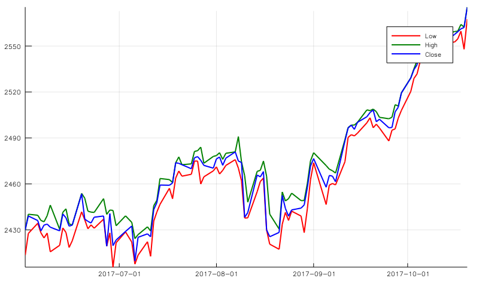

# AlphaVantage

[](https://travis-ci.org/ellisvalentiner/AlphaVantage.jl)

[](https://coveralls.io/github/ellisvalentiner/AlphaVantage.jl?branch=master)

[](http://codecov.io/github/ellisvalentiner/AlphaVantage.jl?branch=master)

A Julia wrapper for the Alpha Vantage API.

## Overview

This package is a Julia wrapper for the Alpha Vantage API. Alpha Vantage provides free realtime and historical data for equities, digital currencies (i.e. cryptocurrencies), and more than 50 technical indicators (e.g. SMA, EMA, WMA, etc.).

The Alpha Vantage API requires a [free API key](https://www.alphavantage.co/support/#api-key).

## Installation

```julia
# AlphaVantage.jl is not currently registered as an official package
# Please install the development version from GitLab:
Pkg.clone("git://gitlab.com/ellisvalentiner/AlphaVantage.jl")
```

If you encounter a clear bug, please file a minimal reproducible example on GitLab.

## Usage

```julia
using AlphaVantage
using DataFrames
using Plots
gr(size=(800,470))
# Get daily S&P 500 data
gspc = daily("^GSPC", apikey=ENV["ALPHA_VANTAGE_API_KEY"]);
# Convert to a DataFrame
data = DataFrame(gspc[2:end, :]);
# Add column names
names!(data, convert.(Symbol, gspc[1,:]));
# Convert timestamp column to Date type
data[:timestamp] = Dates.Date.(data[:timestamp]);
# Plot the timeseries
@df data plot(:timestamp, [:low :high :close], label=["Low" "High" "Close"], colour=[:red :green :blue], w=2)
savefig("sp500.png")
```


